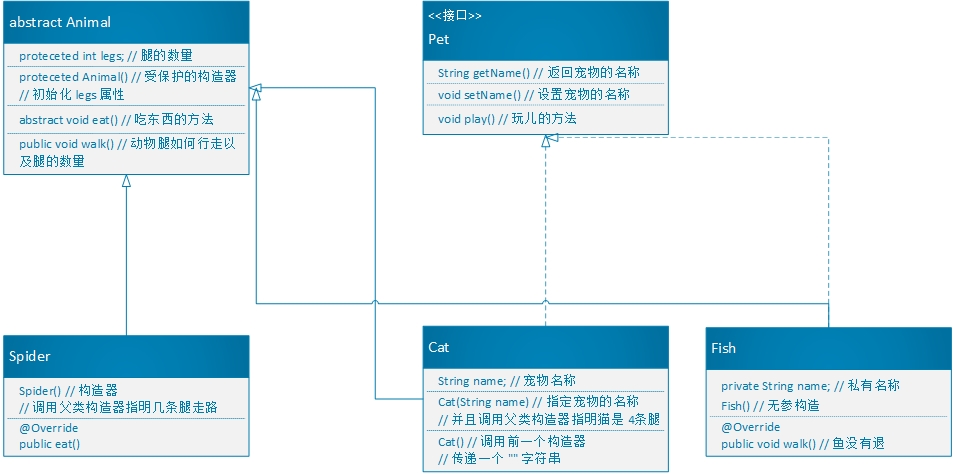

# UML
> 表示 类关系 的图示

## 继承/实现
> 继承,实现

* 空心三角实线: 子类继承父类
* 空心三角虚线: 子类实现父接口
* 实现指向小圆圈: 小圆圈表示父接口

## 依赖
> 一个对象内,构造了另一个对象,或者需要另一个对象的服务

* 虚线箭头: 表示一个对象依赖的对象

## 关联
> 两个相对独立的对象,当一个对象的实例与另一个对象的一些特定实例存在对应关系时

* 实线箭头: 一个对象关联另一个对象

## 聚合
> 弱拥有关系: A对象包含B对象,但B对象不是A对象的一部分,```两个对象拥有不同的生命周期```

* 空心菱形 + 实线箭头: 聚合

## 组合
> 强拥有关系,严格的部分,和整体的关系,部分和整体生命周期一样

* 实心菱形 + 实线箭头: 组合
> 连线的两端的数字,表示该类拥有几个对象

# UML



# 练习 动物

1. 创建Animal类，它是所有动物的抽象父类。
2. 声明一个受保护的整数类型属性legs，它记录动物的腿的数目。
3. 定义一个受保护的构造器，用来初始化legs属性。
4. 声明抽象方法eat。
5. 声明具体方法walk来打印动物是如何行走的（包括腿的数目）。 

## 答案

```java
package cn.how2j._01java初级._07接口与继承._12综合练习.Test;

/**
 * 类作用: 练习
 * 类说明: 综合练习
 * Animal
 *
 * @author 彭继工
 * @date 2020 - 03 - 07:23:29
 */
public abstract class Animal {
    /** 所有动物的腿 */
    protected int legs;

    /**
     * 受保护的构造器
     * 初始化 legs 属性
     * @param legs 动物腿的数量
     */
    protected Animal(int legs) {
        this.legs = legs;
    }

    /**
     * 动物吃饭的方法
     */
    abstract public void eat();

    /**
     * 动物如何行走
     * 打印行走的方式和腿的数目
     */
    public void walk() {
        System.out.println("腿的数量是: " + this.legs);
    }
}
```

#练习 蜘蛛

1. Spider继承Animal类。
2. 定义默认构造器，它调用父类构造器来指明所有蜘蛛都是8条腿。
3. 实现eat方法

## 答案

```java
package cn.how2j._01java初级._07接口与继承._12综合练习.Test;

/**
 * 类作用:
 * 类说明:
 *
 * @author 彭继工
 * @date 2020 - 03 - 07:23:36
 */
public class Spider extends Animal {
    /**
     * 受保护的构造器
     * 初始化 legs 属性
     *
     */
    protected Spider() {
        super(8);
    }

    /**
     * 动物吃饭的方法
     */
    @Override
    public void eat() {
        System.out.println("蜘蛛吃人");
    }
}
```

# 练习 宠物

1. 提供getName() 返回该宠物的名字
2. 提供setName(String name) 为该宠物命名
3. 提供 play()方法
4. 以上设计为接口

## 答案

```java
package cn.how2j._01java初级._07接口与继承._12综合练习.Test;

/**
 * 类作用: 练习
 * 类说明: 接口
 * 练习用的 猫 接口
 *
 * @author 彭继工
 * @date 2020 - 03 - 07:23:38
 */
public interface Pet {
    /**
     * 查看宠物的名称
     *
     * @return 字符串
     */
    String getName();

    /**
     * 设置宠物的名称
     *
     * @param name 名称
     */
    void setName(String name);

    /**
     * 宠物游游玩的方法
     */
    void play();
}
```

# 练习 猫

1. 该类必须包含String属性来存宠物的名字。
2. 定义一个构造器，它使用String参数指定猫的名字；该构造器必须调用超类构造器来指明所有的猫都是四条腿。
3. 另定义一个无参的构造器。该构造器调用前一个构造器（用this关键字）并传递一个空字符串作为参数
4. 实现Pet接口方法。
5. 实现eat方法。

## 答案

```java
package cn.how2j._01java初级._07接口与继承._12综合练习.Test;

/**
 * 类作用:
 * 类说明:
 *
 * @author 彭继工
 * @date 2020 - 03 - 07:23:42
 */
public class Cat extends Animal implements Pet {
    /**
     * 猫的名称
     */
    String name;

    /**
     * 受保护的构造器
     * 初始化 legs 属性
     * 根据 猫 的姓名初始化猫
     *
     * @param name 名称
     */
    protected Cat(String name) {
        super(4);
        this.name = name;
    }

    /**
     * 空构造器
     * 初始化猫的名称为 空字符串
     */
    protected Cat() {
        this("");
    }


    /**
     * 动物吃饭的方法
     */
    @Override
    public void eat() {
        System.out.println(this.name + "在吃奥利给");
    }

    /**
     * 查看宠物的名称
     *
     * @return 字符串
     */
    @Override
    public String getName() {
        return this.name;
    }

    /**
     * 设置宠物的名称
     *
     * @param name 名称
     */
    @Override
    public void setName(String name) {
        this.name = name;
    }

    /**
     * 宠物游游玩的方法
     */
    @Override
    public void play() {
        System.out.println(this.name + "在撤硕玩儿的不亦乐乎");
    }
}
```

# 练习 鱼

1. 创建Fish类，它继承Animal类
2. 重写Animal的walk方法以表明鱼不能走且没有腿。
3. 实现Pet接口
4. 无参构造方法
5. 提供一个private 的name属性

## 答案

```java
package cn.how2j._01java初级._07接口与继承._12综合练习.Test;

/**
 * 类作用: 练习
 * 类说明: 接口
 * 鱼
 *
 * @author 彭继工
 * @date 2020 - 03 - 07:23:48
 */
public class Fish extends Animal implements Pet {

    /**
     * 私有的鱼名称
     */
    private String name;

    /**
     * 受保护的构造器
     * 初始化 legs 属性
     *
     */
    protected Fish() {
        super(0);
    }

    /**
     * 重写的方法
     * 表示鱼没有退
     */
    @Override
    public void walk() {
        System.out.println("鱼是没有退的");
    }

    /**
     * 动物吃饭的方法
     */
    @Override
    public void eat() {
        System.out.println(this.name + "在吃粑粑");
    }

    /**
     * 查看宠物的名称
     *
     * @return 字符串
     */
    @Override
    public String getName() {
        return this.name;
    }

    /**
     * 设置宠物的名称
     *
     * @param name 名称
     */
    @Override
    public void setName(String name) {
        this.name = name;
    }

    /**
     * 宠物游游玩的方法
     */
    @Override
    public void play() {
        System.out.println("大声呐喊奥利给");
    }
}
```