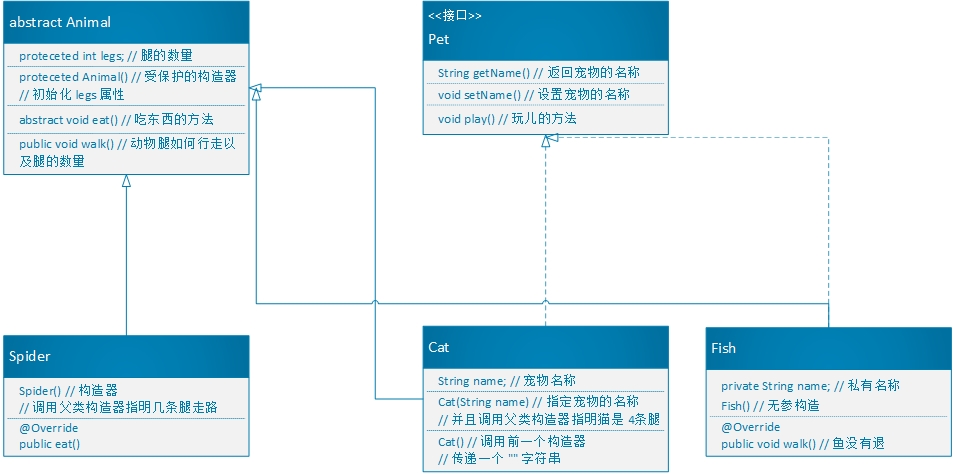

# UML
> 表示 类关系 的图示

## 继承/实现
> 继承,实现

* 空心三角实线: 子类继承父类
* 空心三角虚线: 子类实现父接口
* 实现指向小圆圈: 小圆圈表示父接口

## 依赖
> 一个对象内,构造了另一个对象,或者需要另一个对象的服务

* 虚线箭头: 表示一个对象依赖的对象

## 关联
> 两个相对独立的对象,当一个对象的实例与另一个对象的一些特定实例存在对应关系时

* 实线箭头: 一个对象关联另一个对象

## 聚合
> 弱拥有关系: A对象包含B对象,但B对象不是A对象的一部分,```两个对象拥有不同的生命周期```

* 空心菱形 + 实线箭头: 聚合

## 组合
> 强拥有关系,严格的部分,和整体的关系,部分和整体生命周期一样

* 实心菱形 + 实线箭头: 组合
> 连线的两端的数字,表示该类拥有几个对象

# 练习 Animal

1. 创建Animal类，它是所有动物的抽象父类。
2. 声明一个受保护的整数类型属性legs，它记录动物的腿的数目。
3. 定义一个受保护的构造器，用来初始化legs属性。
4. 声明抽象方法eat。
5. 声明具体方法walk来打印动物是如何行走的（包括腿的数目）。 

## UML

