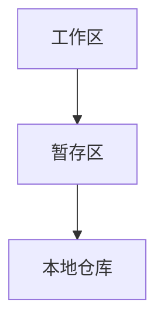

# Git结构



* 工作区: 平时写的代码暂存的地方
* 暂存区: 打算提交但是还没有提交的暂存区域
* 本地仓库: 存储历史版本的本地仓库

```txt
	新建文件在工作区
	使用 git add 推入暂存区
	使用 git commit 将暂存区推入本地库
```

# Git和代码托管中心

## 局域网环境下可以搭建GitLab服务器
## 外网环境下
> GitHub

# 本地库和远程库

## 团队内部协作
## 跨团队协作

# 本地初始化 & 设置签名 (WIN为例)

* 在任何一个想要创建本地库的地方
```
右键点击: Git Bash Here,(在当前窗口开开)
```

* Git要求设置一个如同用户名一样的签名,(同时需要email地址(标记用,并非真正需要))
> 用以区分不用开发人员的身份,(辨析),和代码托管中心(GitHub)没有关系

>> 项目级别/仓库级别: 只是在当前项目内生效(当前本地库范围内生效)
>> 系统用户接: 登录当前操作系统的用户范围
>> 设置好的信息会保存在 用户+ 目录下的 .gitconfig (~/.gitconfig)
>>> 优先级: 就近原则: 项目界别优先于系统用户级别
>>> 不允许二者都没有的情况

## 文件操作命令

|命令 | 作用 |
|---|---|
| cd filepath | 进入目录 |
| cd .. | 返回上级目录 |
| cd ~ | 进入用户 + ? 目录 | 
| ll | 查看当前文件夹内所包含的内容 |
| mkdir foldername | 新建目录 |
| touch file | 创建文件 |
| ls -la | 查看当前文件夹下的(包含隐藏文件) |
| ls -l\|less | 分屏查看文件 |
| cat file | 查看当前文件的内容 |
| vim file | 使用vim编辑器编辑文件 |
| rm file | 删除文件 |
| rm -r floder/ | 删除目录 |

1. 以 . 开头的文件(或目录)为隐藏资源

### vim操作

* esc i 进入编辑模式
* esc :wq 保存退出
* esc :set nu 设置显示行号

### 多平显示控制方式

* space 向下翻页
* b 向上翻页
* q 退出

## 初始化 & 设置签名命令

| 命令 | 作用 |
|---|---|
| git init | 在当前目录初始化本地库 |
| git config user.name name | 设置项目级别的用户名签名
| git config user.email email | 设置项目界别的用户邮箱地址签名
| git config --global user.name name | 设置系统级别的用户名签名
| git config --global user.email email | 设置系统级别的用户邮箱地址签名

> 注意: .git 目录中存放本地库的子目录和文件,不要轻易篡改删除

# Git具体操作

## 添加,提交,查看状态命令

| 命令 | 作用 |
|---|---|
| git status | 查看当前工作区和缓存区状态 |
| git add file | 往暂存区推入文件 |
| git add --all | 往暂存区推入所有文件 |
| git commit file | 将暂存区推入本地库(同时进行注释编辑) |
| git commit --all | 推送所有文件 |
| git commit -m "description" file | 直接提交(不仅如此编辑界面)
| git rm --cached file | 撤回当前的推入操作 |

# 历史版本操作
> Git每个版本都会有一个历史记录
>> 会有一个 HEAD 指针指向当前所处的版本

* 改变当前版本实质上就是移动 HEAD 指针

```
具体操作:
	基于索引值(hash 简写),建议使用此操作
	基于 ^
	基于 ~
```

### 操作的区别

* soft(软操作): 仅仅在本地库移动HEAD指针
* mixed(混合操作?): 在本地库移动HEAD指针,同时重置暂存区
* hard(硬操作): 暂存区和工作区都会被重置

## 历史版本命令

| 命令 | 作用 |
|---|---|
| git log | 查看所有的历史版本(分屏显示) |
| git log --pretty=oneline | 以逐行的形式显示历史版本 |
| git log --oneline | 以更简洁的方式显示(只显示一部分哈希值,指针,描述) |
| git reflog | 在逐行显示历史版本的同时显示指针移动需要的步长 |
| git reset --opertion index | 到达索引版本 |
| git reset --opertion HEAD^ | 向后回退指定的 ^ 步数 |
| git reset --opertion HEAD~number | 指定回退的版本数量 |

# 删除文件后找回
> 其本质还是利用版本回退的方式进行,(建立在有历史版本的情况下)

* 从暂存区删除: 直接恢复上个版本即可
> Git只会增加版本,很少会进行删除操作

```
	这些操作必须建立在,前版本推送到了本地库
```

# 比较文件

| 命令 | 作用 |
|---|---|
| git diff file | 比较暂存区和当前文件的差异 |
| git diff index | 比较多个文件 |
| git diff index file | 比较本地库(或历史版本)和当前文件的差异,(index = 哈希,HEAD^,HEAD~number) |